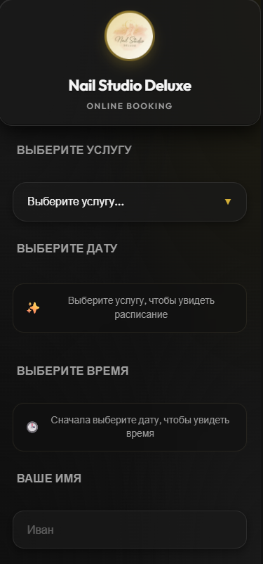
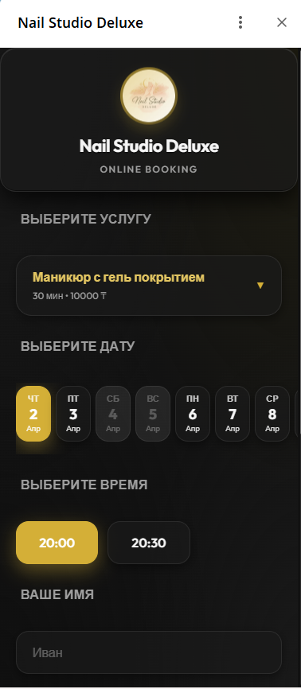
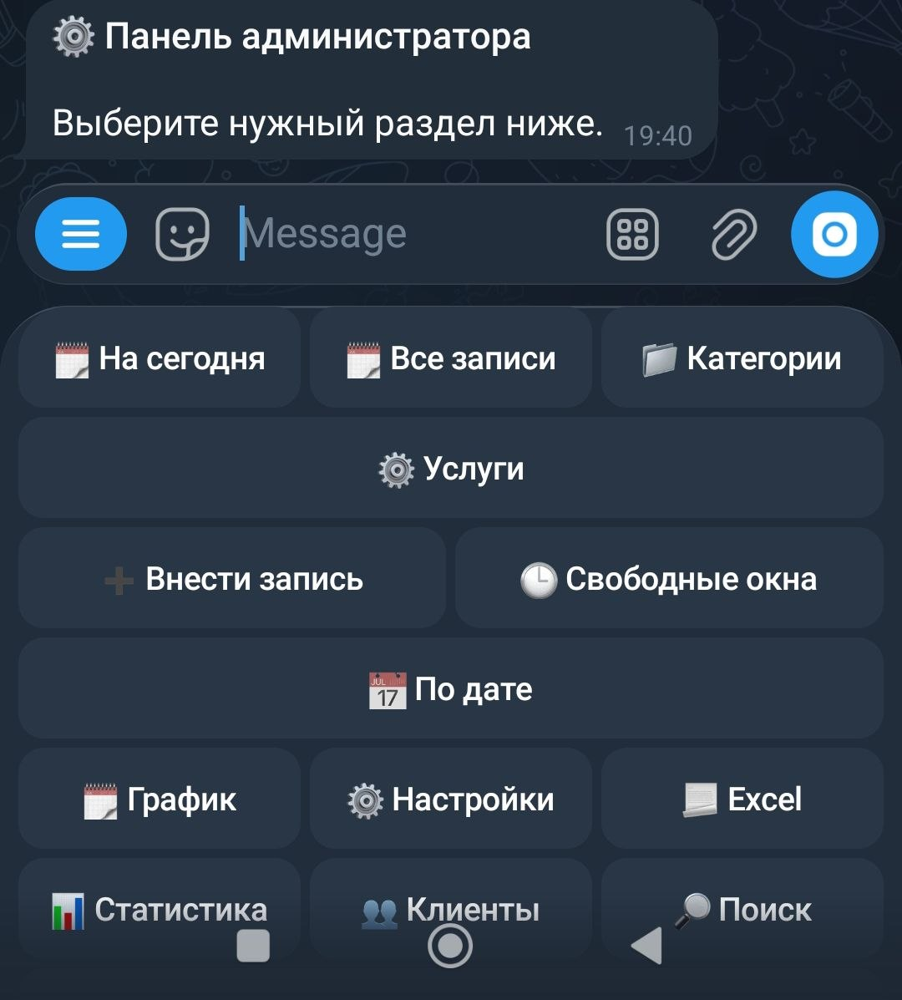
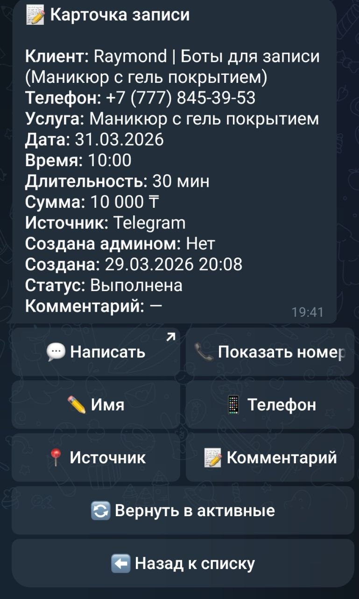
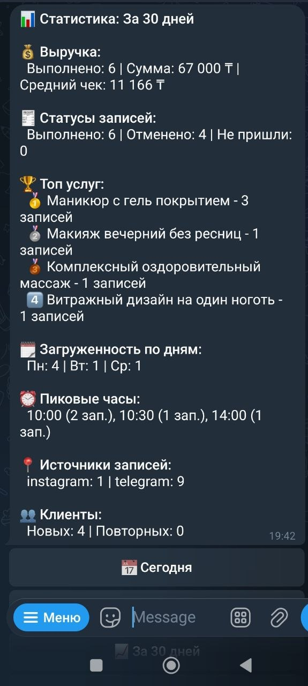

# Booking System for Service Businesses

Telegram-based booking system for beauty professionals and small service businesses.

This project combines:

- a Telegram bot
- a Telegram WebApp
- an admin panel inside the bot
- a FastAPI backend
- a SQLite database

It was built as a real product-style system for businesses that want online booking, but still receive clients from Telegram, WhatsApp, Instagram, calls, and offline requests.

## Status

`Portfolio project` - `Production-style case study` - `Full-stack bot + WebApp system`

## Highlights

- Telegram bot + Telegram WebApp
- FastAPI backend
- Admin booking management
- Client database and Excel exports
- Booking reminders and digests
- VPS deployment with `nginx` and `systemd`

## Demo

Screenshots are included below. A live demo can be shown on request.

## TL;DR

This is not just a "booking bot".

It is a lightweight booking management system where:

- clients can book online through Telegram WebApp
- admins can manually add bookings from external channels
- all bookings stay in one place
- the business gets reminders, status management, client history, exports, and admin tools

## Why This Project Matters

Many solo professionals and small studios still manage appointments manually across multiple channels.
That usually leads to:

- missed bookings
- messy scheduling
- poor visibility into free slots
- no clean client history
- no reporting

This project solves that by giving the business owner one structured system for booking and schedule management, while still allowing clients to come from different channels.

## Main Features

- Online booking through Telegram WebApp
- Manual booking creation by admin
- Booking reschedule and cancellation flows
- Active bookings and booking history for clients
- Free slot checking
- Booking statuses:
  - `scheduled`
  - `completed`
  - `cancelled`
  - `no_show`
- Client database inside the admin panel
- Excel exports:
  - all bookings
  - completed services
  - client base
- Daily admin digests:
  - today
  - tomorrow
- Booking source tracking:
  - Telegram
  - WhatsApp
  - Instagram
  - phone
  - offline
  - manual
- Phone-based client linking between manual and Telegram bookings
- Automatic reminders and booking notifications
- SQLite backups
- VPS deployment with `nginx`, `systemd`, and HTTPS

## Product Positioning

This project can be presented as:

- a booking system for beauty professionals
- a Telegram-based booking management system
- a scheduling product for service businesses
- a full-stack bot + WebApp + backend portfolio case

## User Flows

### Client Flow

- Open the bot
- Launch the WebApp
- Choose a service
- Choose a date and time
- Enter name and phone
- Confirm booking
- View active bookings and booking history in Telegram

### Admin Flow

- Open admin menu inside the bot
- View bookings for today, all bookings, or bookings by date
- Add bookings manually
- Check free slots
- Edit booking details
- Reschedule bookings
- Cancel bookings
- Change statuses
- Export reports to Excel
- View client list and statistics

## Tech Stack

### Backend

- Python
- FastAPI
- Aiogram
- SQLite

### Frontend

- HTML
- CSS
- Vanilla JavaScript
- Telegram WebApp API

### Infrastructure

- VPS
- `nginx`
- `systemd`
- HTTPS

## Architecture

The system consists of four main parts:

1. Telegram bot for client and admin interactions
2. Telegram WebApp frontend for the booking form
3. FastAPI backend for content delivery and booking API
4. SQLite database for bookings, services, categories, and schedule logic

## What Makes This a Strong Portfolio Project

This is a production-style portfolio project rather than a simple CRUD demo.

It shows:

- real business logic around schedules and booking validation
- multi-step Telegram bot flows
- WebApp integration
- admin-side tools
- reporting and Excel exports
- VPS deployment and service management
- iteration based on real UX and product issues

## Technical Challenges Solved

- Telegram WebApp integration and launch flows
- Client/admin role separation inside a single bot
- Booking validation with:
  - service duration
  - working hours
  - busy slots
  - breaks
  - lunch time
  - blacklisted dates
- Linking manual bookings to Telegram users by phone number
- Handling external WebApp entry and bot handoff
- Admin-side booking management without breaking client-side logic
- Exporting business data in a usable format
- Running the product on a VPS with stable restart and backup logic

## Project Structure

```text
bot_handlers/       Telegram bot handlers
bot_keyboards/      Telegram keyboards and UI builders
repositories/       Database access layer
js/                 WebApp frontend logic
styles/             WebApp styling
scripts/            Utility and migration scripts
docs/               Deployment and project notes
main.py             FastAPI app + bot startup
database.py         Repository exports
booking_service.py  Booking orchestration and notifications
booking_validation.py Booking validation rules
```

## Screenshots

### Client WebApp


### Booking Flow


### Admin Bookings


### Booking Details


### Admin Statistics


## Running Locally

### 1. Create virtual environment

```bash
python -m venv .venv
```

### 2. Install dependencies

```bash
.venv\Scripts\python.exe -m pip install -r requirements.txt
```

### 3. Prepare environment

Create `.env` and configure the required variables.

Typical values include:

- `BOT_TOKEN`
- `ADMIN_ID`
- `PORT`
- `WEBAPP_URL`
- `WEBAPP_AUTH_REQUIRED`

### 4. Start the app

```bash
.venv\Scripts\python.exe main.py
```

## Deployment Notes

The project is structured for VPS deployment.

Useful references:

- [server-cheatsheet.md](/c:/Users/User/Desktop/Main%20Project/docs/server-cheatsheet.md)
- [vps-deploy-guide.md](/c:/Users/User/Desktop/Main%20Project/docs/vps-deploy-guide.md)

## My Role

This project can be presented as a full-cycle product case.

My role included:

- product logic design
- backend implementation
- Telegram bot flows
- WebApp frontend
- booking validation logic
- reporting and Excel exports
- VPS deployment
- debugging and UX iteration

## What This Project Demonstrates

- Full-stack development
- Bot + WebApp architecture
- Practical backend validation logic
- Admin workflow design
- Deployment and maintenance skills
- Real-world debugging and iteration

## Notes

The project was tested as a real product and improved through practical edge cases, including:

- booking conflicts
- duplicate services
- manual booking scenarios
- client linking by phone
- external launch flows
- admin UX issues

That makes it especially valuable for a portfolio: it demonstrates not only coding, but also product thinking, operations, and problem-solving in realistic conditions.
